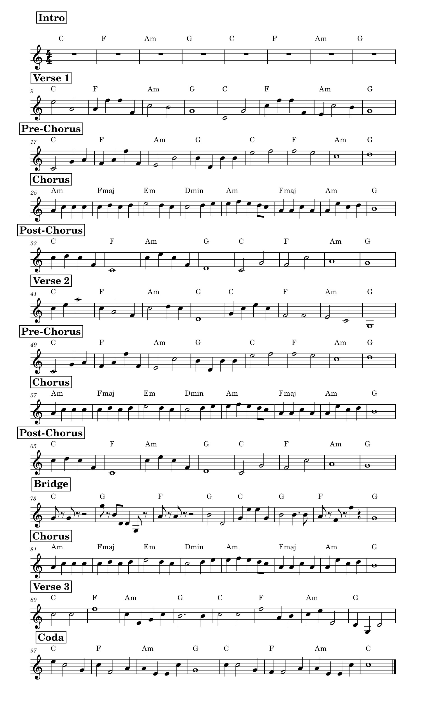

<audio controls style="width: 60%; display: block; margin: 7vw auto 5vw;">
    <source src="../assets/compositions/examination-composition.wav" type="audio/wav">
    Your browser does not support the audio tag.
</audio>

When I first began working on this I was very confused. It was unfamiliar to me, and I needed to have a finished product to be judged and reviewed. In order to more effectively understand how to compose, I spent some time reviewing the various song forms that we studied in class:

<ul id="ul">
    <li>Strophic</li>
    <li>Binary</li>
    <li>Pre-chorus</li>
    <li>Bridge</li>
    <li>Coda</li>
    <li>Post-chorus</li>
    <li>32-bar form</li>
    <li>Chorus</li>
    <li>Refrain</li>
    <li>Introduction</li>
    <li>Verse</li>
    <li>ABAC-form</li>
    <li>Through-composed</li>
    <li>Front-loaded chorus</li>
</ul>

Each of these forms offered a different manner of storytelling in music, and I needed to select the most suitable one for my material. Having weighed my options, I chose to organize my song like this:

<table>
	<tr>
		<td>Intro</td>
		<td>Verse 1</td>
		<td>Chorus</td>
		<td>Post-Chorus</td>
		<td>Verse 2</td>
		<td>Pre-Chorus</td>
		<td>Chorus</td>
		<td>Post-Chorus</td>
		<td>Bridge</td>
		<td>Chorus</td>
		<td>Verse 3</td>
		<td>Coda</td>
    </tr>
</table>

This seemed to give me room to build up but also room for emotional depth. The hardest thing was knowing where to start. I began to browse through the virtual instruments available to me, taking into consideration the tone and texture of each sound. I chose a clean and soft guitar for the main melody that I thought would help to develop a warm atmosphere and a lofi piano for the chords to provide some character. But I was struggling to include other elements like drums and bass, not knowing what would fit with the overall mood that I was attempting to create.

As I went along, I was enjoying the process more and more. I started listening to different styles and genres of music and breaking down other songs to see how they were constructed. I experimented with different chord progressions that were on my mind, and I discovered a lot about how different things could be put together in a way that would sound good. I also liked the ability to add some personal touch, so I went ahead and added a softly played string orchestra in the chorus. I felt that it created a layer of depth that worked well with the rest of the instrumentation. Hearing the completed work, I realize that there is much for me to learn about choosing the proper elements and techniques for a song. There were a few points where I was unsure if I was making the optimal choices, but I suppose that is simply part of the process. I would like to feel more comfortable in this art setting and be able to see the full range of what is possible with music composition.

<h2>Piano Score</h2>

