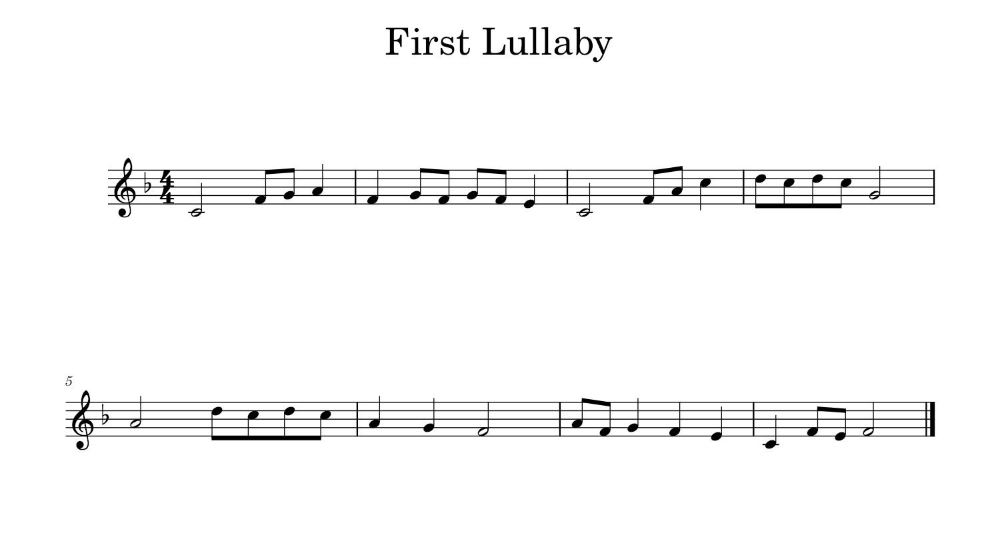
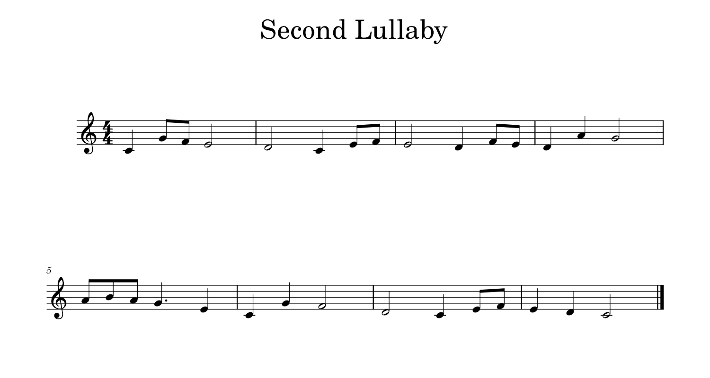
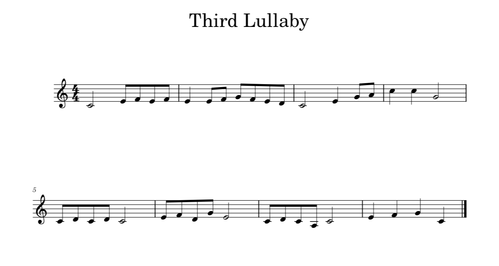
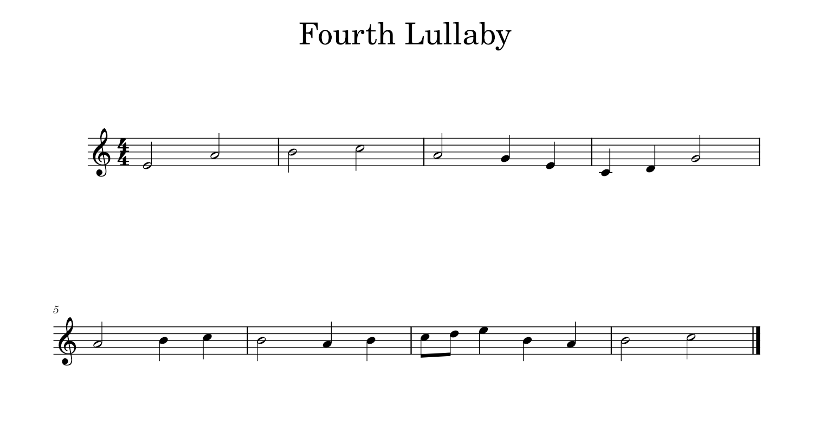

	

        

            
            <audio controls style="width: 100%;">
                <source src="../assets/compositions/first_lullaby.mp3" type="audio/mpeg">
                Your browser does not support the audio tag.
            </audio>
        

	

	

		<h3>Composing First Lullaby</h3>
		
For the first lullaby out of four, I worked really hard to find a melody I liked. I tried over and over again, experimenting with different ideas. My goal was to use simple leaps and scales to keep the melody easy and pleasant. After many attempts, I finally created a melody that I really loved. I wanted it to end on a C note, but when I couldn’t make that happen, I decided to go with F major instead. Even though it wasn’t what I originally planned, I think it turned out beautifully. This lullaby ended up being my favorite of all the ones I wrote.

	

 
 

	

        

            
            <audio controls style="width: 100%;">
                <source src="../assets/compositions/second_lullaby.mp3" type="audio/mpeg">
                Your browser does not support the audio tag.
            </audio>
        

	

	

		<h3>Composing Second Lullaby</h3>
		
For my second lullaby I tried recreating the process for the first one, but it ended up taking a lot of time. Nevertheless, I still managed to make a melody I liked, but I worry the form mimics the first one too much.

	

 
 

	

        

            
            <audio controls style="width: 100%;">
                <source src="../assets/compositions/third_lullaby.mp3" type="audio/mpeg">
                Your browser does not support the audio tag.
            </audio>
        

	

	

		<h3>Composing Third Lullaby</h3>
		
For my third lullaby, I tried to change things up a bit. I wanted a soft, smooth melody, but it didn’t turn out how I thought it would. Instead of being simple, the melody became a bit harsh and different. Even though it’s not what I planned, I like how it turned out.

	

 
 

	

        

            
            <audio controls style="width: 100%;">
                <source src="../assets/compositions/fourth_lullaby.mp3" type="audio/mpeg">
                Your browser does not support the audio tag.
            </audio>
        

	

	

		<h3>Composing Fourth Lullaby</h3>
		
For the final lullaby, I changed my approach again. I wanted to create a slower and softer melody this time. I hoped it would feel more calming and gentle.

	

