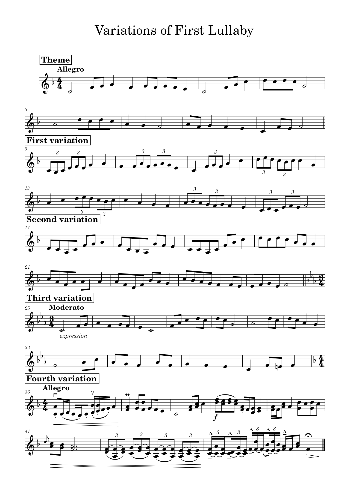

	

        

            <audio controls style="width: 100%; margin: 50px 0px 0px 0px;">
                <source src="../assets/compositions/theme_and_variations.mp3" type="audio/mpeg">
                Your browser does not support the audio tag.
            </audio>
            
        

	

	

		<h3 style="margin-bottom: 0px;">Theme</h3>
        <audio controls style="width: 100%;">
                <source src="../assets/compositions/theme.mp3" type="audio/mpeg">
                Your browser does not support the audio tag.
            </audio>
        
I chose to use my first lullaby as the theme.

		<h3 style="margin-bottom: 0px;">First Variaton</h3>
        <audio controls style="width: 100%;">
                <source src="../assets/compositions/first_variation.mp3" type="audio/mpeg">
                Your browser does not support the audio tag.
            </audio>
        
For the first variation, I decided to incorporate triplets into the melody, to create a quick and brisk feel.

		<h3 style="margin-bottom: 0px;">Second Variation</h3>
        <audio controls style="width: 100%;">
                <source src="../assets/compositions/second_variation.mp3" type="audio/mpeg">
                Your browser does not support the audio tag.
            </audio>
        
I decide to use eight notes and quarter notes while stile keeping the same impression as in the theme.

		<h3 style="margin-top: 35px; margin-bottom: 0px;">Third Variation</h3>
        <audio controls style="width: 100%;">
                <source src="../assets/compositions/third_variation.mp3" type="audio/mpeg">
                Your browser does not support the audio tag.
            </audio>
        
I aimed at creating a sad variation. I decided to try using a 3/4 time signature and did my best to make it somber.

		<h3 style="margin-bottom: 0px;">Fourth Variation</h3>
        <audio controls style="width: 100%;">
                <source src="../assets/compositions/fourth_variation.mp3" type="audio/mpeg">
                Your browser does not support the audio tag.
            </audio>
        
I wanted to make this the most wild and difficult, to really have fun with it. This one took the longest time to make, as I was searching for sections that fit together to make it feel rampant. In the end I rethought a lot of the pieces in it, and restructured it too.

	

